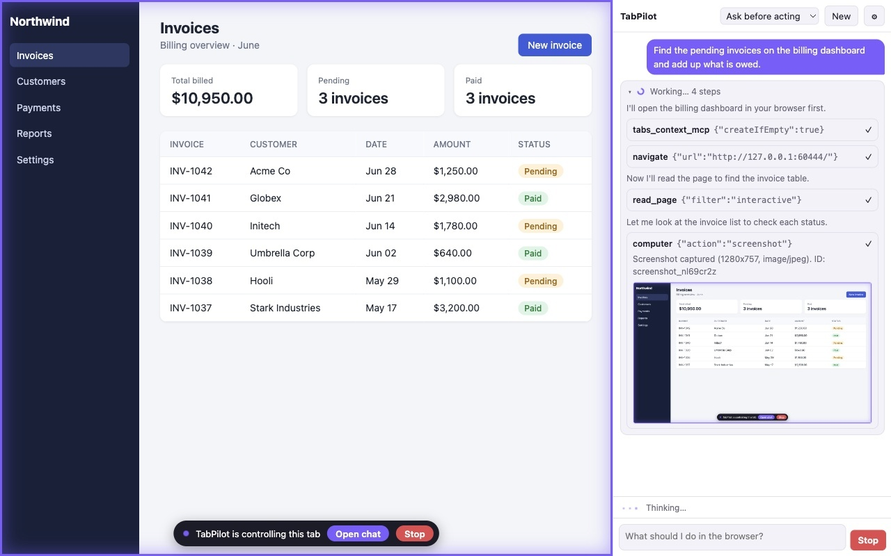
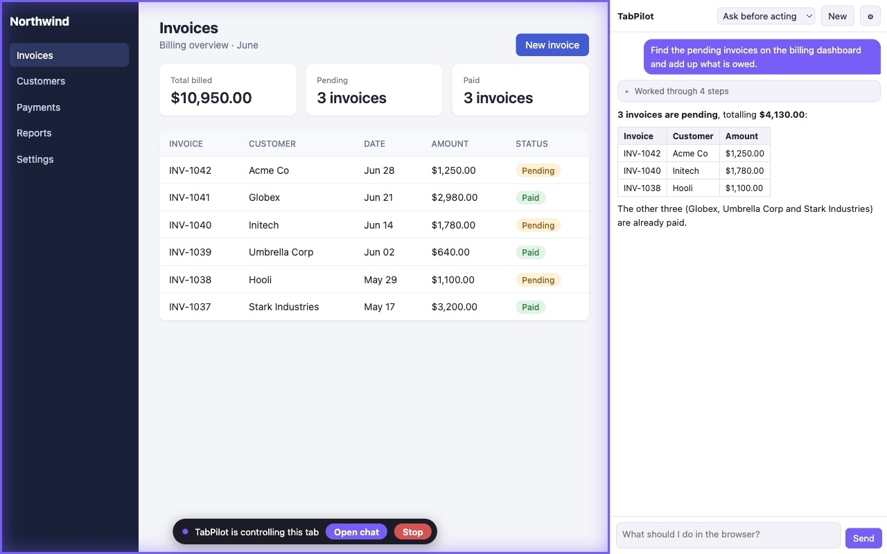
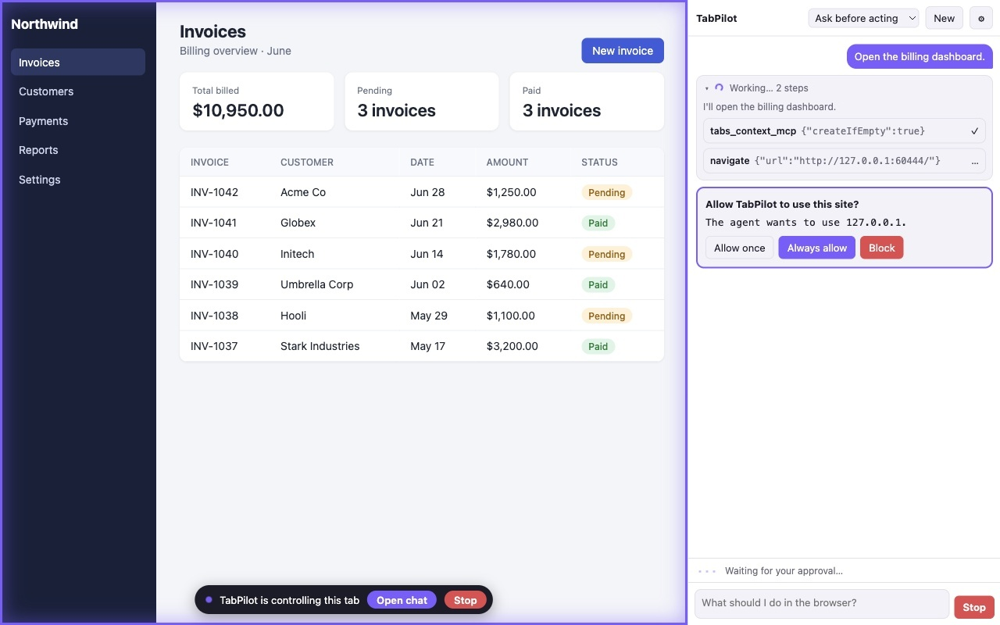
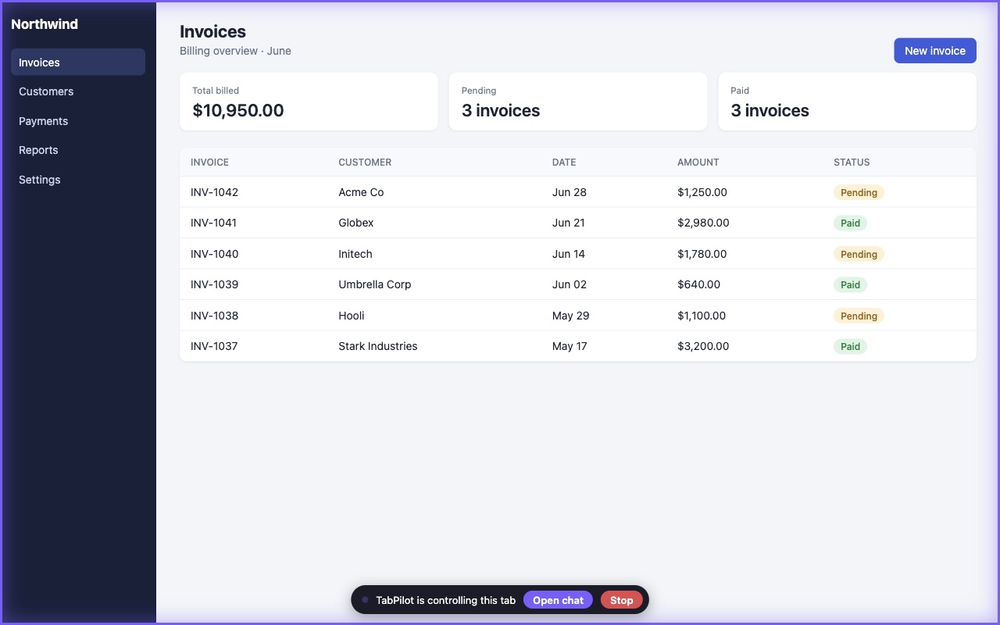
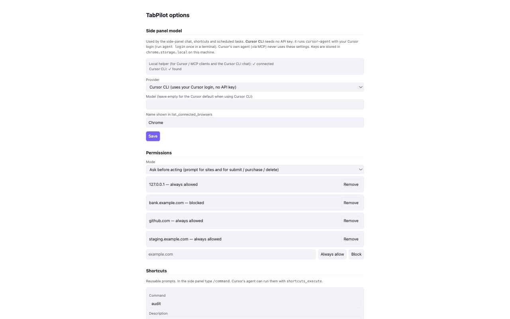

# TabPilot

**Let an AI agent use your real, logged-in Chrome.** TabPilot is an unofficial, open-source Chrome extension plus a small local helper. It lets an agent you choose (Cursor's agent, or the extension's built-in side-panel chat) see and control your browser to test web apps, read pages behind a login, fill forms and debug front-end problems.

> TabPilot is not affiliated with or endorsed by Cursor/Anysphere, Anthropic, Google or OpenAI.

## You stay in control

- The agent only works in its own tab group. Your other tabs are never touched.
- Per-site permissions (allow once, always allow, block) and an "Ask before acting" mode that asks before any submit, purchase or delete.
- A visible bar on controlled tabs with a **Stop** button that cancels everything at once.
- It never types into password or payment fields and never solves CAPTCHAs. Page content is treated as data, never as instructions.
- No servers, no analytics, no tracking. See the [privacy policy](privacy/).

| | |
|---|---|
|  |  |
|  |  |

## Support

- **Email:** [jyotirajsingh3@gmail.com](mailto:jyotirajsingh3@gmail.com)
- **Report a problem or ask a question:** open an [issue](https://github.com/jyotiraj007/web/issues) and put "TabPilot" in the title.
- **Security issues:** please email instead of opening a public issue.

### Common questions

**The chat says it needs a model.** The side-panel chat needs either the Cursor CLI (signed in with `agent login`) or your own API key. Open the extension's options page (the ⚙ in the panel) and choose a provider; the page shows what is and isn't connected.

**The side panel doesn't show up on a tab.** TabPilot's panel only appears on tabs in its own tab group. Click the TabPilot toolbar icon on the tab you want to use; that tab joins the group and the panel opens there.

**Cursor can't see the browser tools.** The tools need the local helper installed and the extension loaded. The options page shows whether the helper is connected.

## Pages

- [Privacy policy](privacy/)
- [Screenshots](assets/)
